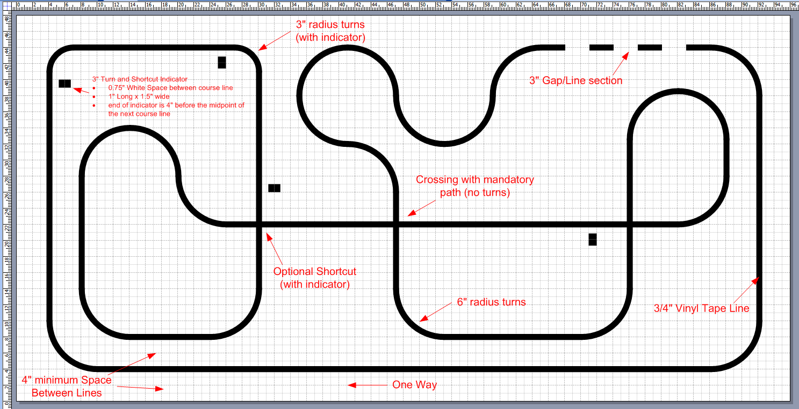
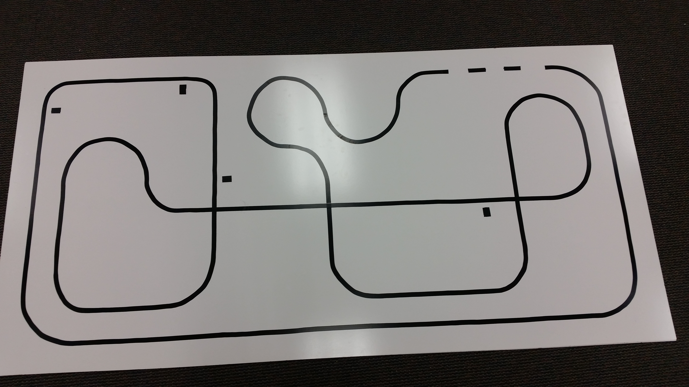
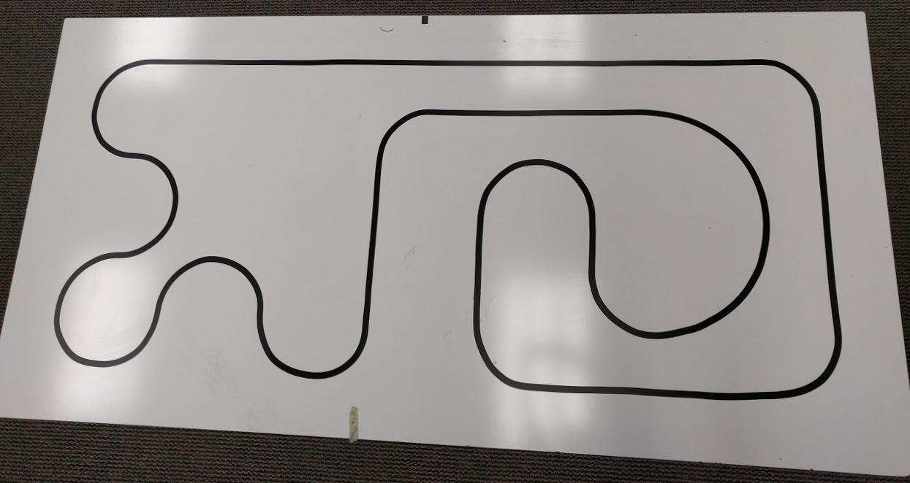

We will be running competitions on both the new (advanced) and old (classic) courses. Your robot(s) can compete on either or both.

This is the advanced course:

This is the classic course:

Each course also has a respective mirrored version that your robot will have to navigate as well.

Some details are still TBD, but otherwise the [original line following rules](/events/line_following_rules) should apply. If you are interested in building your own course, you might find [this guide](https://www.pololu.com/docs/0J22) helpful.
