Our second robot competition was hosted by Rancho High School in North Las Vegas.

We had 15 competitors from 4 states who pitted their 24 robots against our line following, sumo and line maze events.

The small line following track had 2 straight tiles, and 12 curve tiles, for a total 3 lap length of about 1045 cm.
The large line following track had 12 straight tiles, adn 24 curve tiles, for a total 3 lap length of about 2821 cm.
Each line followers best speed is listed.

Prizes were graciously donated by [Pololu Robotics](http://www.pololu.com)

<table>
<tr>
<td>
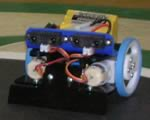 
B. Dog 
Brandon Hjelstrom
</td>
<td>
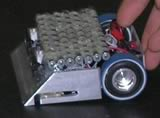 
Below Average 
Jan Malasek / Gary Cole 

</td>
<td>
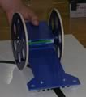 
Blue Lightning 
Tim Garrabrant 
51.5 cm/s
</td>
</tr>
<tr>
<td>
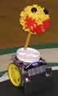 
Bucky 2.0 
Scott Garrabrant 
</td>
<td>
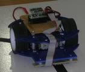 
Bullet 
Byon Garrabrant 
67.6 cm/s
</td>
<td>
 
Cambot 
Byon Garrabrant 
14.5 cm/s
</td>
</tr>
<tr>
<td>
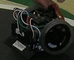 
Challen 
John Abshier 

</td>
<td>
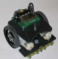 
Clyde 
Byon Garrabrant 
</td>
<td>
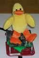 
Ducky 
Richard Furnis 
38.6 cm/s
</td>
</tr>
<tr>
<td>
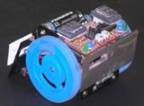 
Dummy 
Dustin Cole
</td>
<td>
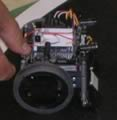 
Gian 
John Abshier 

</td>
<td>
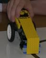 
Golden Candypop 
Scott Garrabrant 
46.7 cm/s
</td>
</tr>
<tr>
<td>
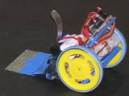 
Happy Jr. 
Byon Garrabrant 
</td>
<td>
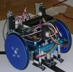 
Jose Valdez 
John Abshier 
</td>
<td>
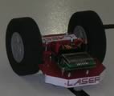 
Laser 
Byon Garrabrant 
70.8 cm/s
</td>
</tr>
<tr>
<td>
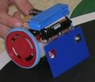 
Mr. Happy 
Tim Garrabrant 
</td>
<td>
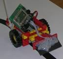 
Mr. Wiggles 
Candice Kamachi 
28.9 cm/s
</td>
<td>
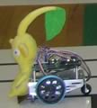 
Quoridor 
Scott Garrabrant 
</td>

</tr>
<tr><td>
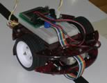 
Red Rover 
Michael Griffith 
7.5 cm/s
</td>
<td>
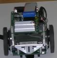 
Re-Volt 
Stan Hanel 
14.5 cm/s
</td>
<td>
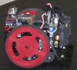 
Skippy 
John Major
</td>

</tr>
<tr>	<td>
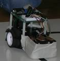 
Spare Parts 
Rick Rowland
</td>
<td>
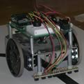 
BoeBot &quot;Twitch&quot; 
Dave LeBlanc 
13.9 cm/s
</td>
<td>
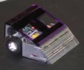 
Ultra Violet 
Paul Grayson
</td>
</tr>
</table>
<h2>Line Following Brackets</h2>

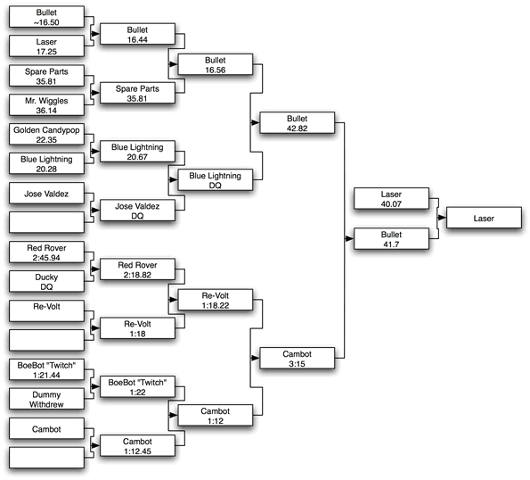

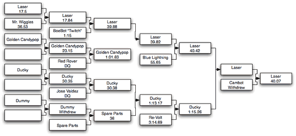

<h2>Sumo Brackets</h2>

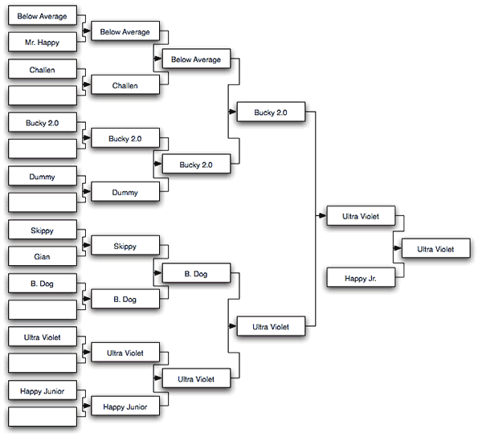 

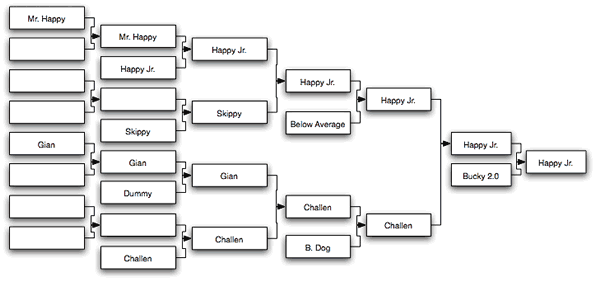

<h2> 
</h2>
