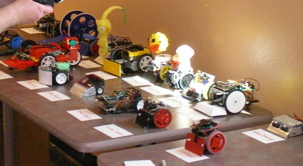
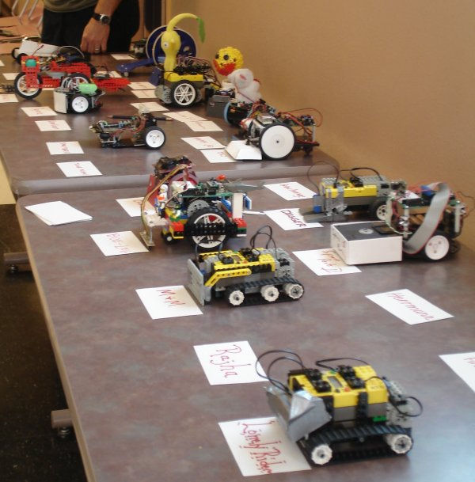
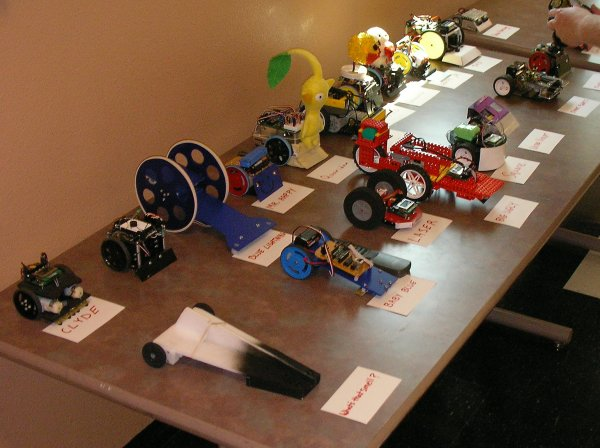
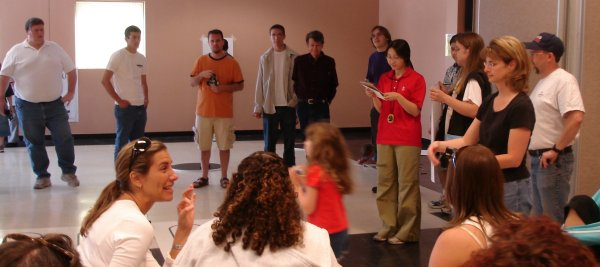
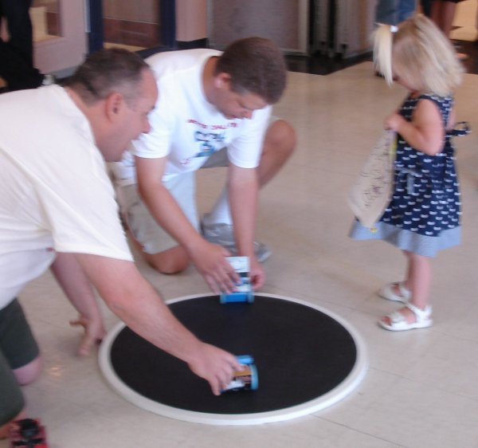
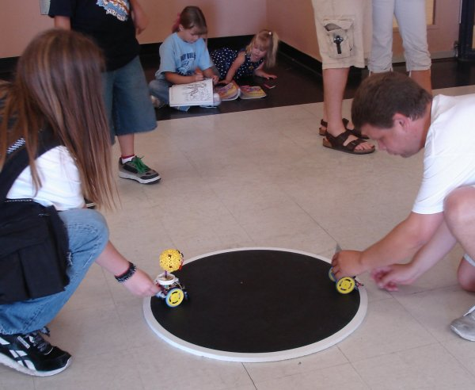
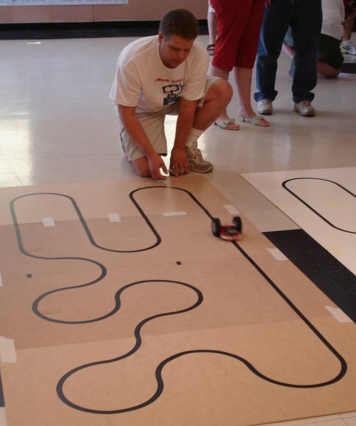
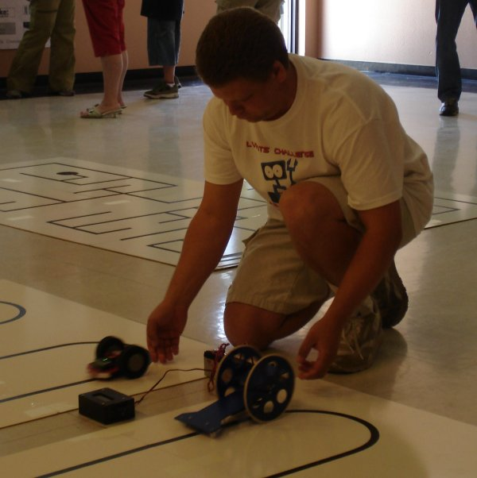
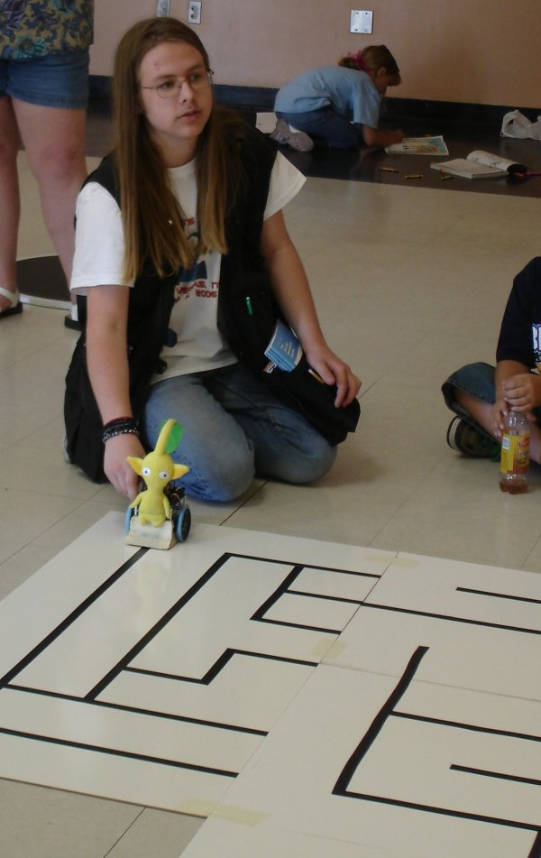

Our third robot competition was held at Durango Hills Community Center / YMCA in the north west area of Las Vegas.
We had 36 robots competing in the 3 events, and many new builders we had not seen in our previous competitions.

**<a href="https://www.lvbots.org/gallery/member.php?id=10">Jan Malasek</a>** did exceptionally well, taking **First Place in All Three Events!**  Congratulations Jan!

We would like to thank the following sponsors for their gracious prize dontations:

Line Following Results

Robots had to make 3 laps around the track without falling off, and were given 2 chances to do this. 
We started with preliminary races to determine the top 8, and then had a single elimination bracket to
pick the top 4 winners.  Although <a href="https://www.lvbots.org/gallery/bot.php?id=2">Laser</a> had the shortest time, it fell off the track twice during the
semi-finals which allowed <b><a href="https://www.lvbots.org/gallery/bot.php?id=41">What's That Smell?</a></b> to take first place.
The line following track had 12 straight tiles, and 24 curve tiles, for a total 3 lap length of about 2821 cm.  

<table>
<tr><td align="center"></td><td align="center"><b>Robot</b></td><td align="center"><b>Builder</b></td><td align="center"><b>Best Time</b></td></tr>
<tr><td align="center"><b>1st Place</b></td><td align="center"><a href="https://www.lvbots.org/gallery/bot.php?id=41">What's That Smell?</a></td><td align="center"><a href="https://www.lvbots.org/gallery/member.php?id=10">Jan Malasek</a></td><td align="center">0:37 seconds</td></tr>
<tr><td align="center"><b>2nd Place</b></td><td align="center"><a href="https://www.lvbots.org/gallery/bot.php?id=28">Blue Lightning</a></td><td align="center"><a href="https://www.lvbots.org/gallery/member.php?id=1">Byon Garrabrant</a></td><td align="center">0:53 seconds</td></tr>
<tr><td align="center"><b>3rd Place</b></td><td align="center"><a href="https://www.lvbots.org/gallery/bot.php?id=2">Laser</a></td><td align="center"><a href="https://www.lvbots.org/gallery/member.php?id=1">Byon Garrabrant</a></td><td align="center">0:36 seconds</td></tr>
<tr><td align="center"><b>4th Place</b></td><td align="center">Big Ugly</td><td align="center"><a href="https://www.lvbots.org/gallery/member.php?id=12">Candice Kamachi</a></td><td align="center">0:41 seconds</td></tr>
<tr><td align="center"></td><td align="center"><a href="https://www.lvbots.org/gallery/bot.php?id=33">Quixo</a></td><td align="center"><a href="https://www.lvbots.org/gallery/member.php?id=21">Scott Garrabrant</a></td><td align="center">1:14</td></tr>
<tr><td align="center"></td><td align="center">Spare Parts II</td><td align="center"><a href="https://www.lvbots.org/gallery/member.php?id=14">Rick Rowland</a></td><td align="center">1:29</td></tr>
<tr><td align="center"></td><td align="center">Boe Leg</td><td align="center"><a href="https://www.lvbots.org/gallery/member.php?id=11">Dave LeBlanc</a></td><td align="center">1:52</td></tr>
<tr><td align="center"></td><td align="center">Blue Lightning</td><td align="center">Amber Zeigenbein</td><td align="center">2:00</td></tr>
<tr><td align="center"></td><td align="center">DK1</td><td align="center"><a href="https://www.lvbots.org/gallery/member.php?id=24">Dennis Krostoski</a></td><td align="center">2:05</td></tr>
<tr><td align="center"></td><td align="center">Manly Bug</td><td align="center">Sean Jahanpour</td><td align="center">1:47</td></tr>
<tr><td align="center"></td><td align="center">Lonely Rider</td><td align="center">Julie Tognoni & Michael Narrison</td><td align="center">2:27</td></tr>
<tr><td align="center"></td><td align="center">Crimson</td><td align="center"><a href="https://www.lvbots.org/gallery/member.php?id=4">Mike Griffith</a></td><td align="center">2:29</td></tr>
<tr><td align="center"></td><td align="center">Line Walker</td><td align="center">Josh Beltran</td><td align="center">2:42</td></tr>
<tr><td align="center"></td><td align="center">Lil Angel</td><td align="center">Angel Penaloza</td><td align="center">3:50</td></tr>
<tr><td align="center"></td><td align="center">Spare Parts</td><td align="center"><a href="https://www.lvbots.org/gallery/member.php?id=25">Eric Schmidthuber</a></td><td align="center">-</td></tr>
<tr><td align="center"></td><td align="center">First Time</td><td align="center">Leslie Dalton & Kim Krempel</td><td align="center">-</td></tr>
<tr><td align="center"></td><td align="center">Herrmann</td><td align="center">Jaime Nikiton & Michelle Foucault</td><td align="center">-</td></tr>
<tr><td align="center"></td><td align="center">Rajha</td><td align="center">Wendy Lindow & Angela Denari</td><td align="center">-</td></tr>
</table>

Mini Sumo Results

The Mini Sumo preliminary events were a chance for every bot to have a single battle with every other.
Then the top 8 from the preliminaries went on to a single elimination bracket of best 2 of 3 battles.
We had 4 competitors who did not know that there was a size limit, and built bots from Lego Mindstorm kits, so they turned out a bit too large, but the judges decided to allow them to compete anyway.
Although <b>Ultra Violet</b> was in 8th place in the prelimininary rounds, it went on to take First Place Sumobot!
<table>
<tr><td align="center"></td><td align="center"><b>Robot</b></td><td align="center"><b>Builder</b></td><td align="center"><b>Preliminary Wins</b></td></tr>
<tr><td align="center"><b>1st Place</b></td><td align="center">Ultra Violet</td><td align="center"><a href="https://www.lvbots.org/gallery/member.php?id=10">Jan Malasek</a></td><td align="center">6 wins</td></tr>
<tr><td align="center"><b>2nd Place</b></td><td align="center">Crimson</td><td align="center"><a href="https://www.lvbots.org/gallery/member.php?id=4">Mike Griffith</a></td><td align="center">10 wins</td></tr>
<tr><td align="center"><b>3rd Place</b></td><td align="center">Guess What?</td><td align="center">Erwin & Rob</td><td align="center">8 wins</td></tr>
<tr><td align="center"><b>4th Place</b></td><td align="center">Junk Man</td><td align="center"><a href="https://www.lvbots.org/gallery/member.php?id=25">Eric Schmidthuber</a></td><td align="center">10 wins</td></tr>
<tr><td align="center"></td><td align="center"><a href="https://www.lvbots.org/gallery/bot.php?id=9">Happy Jr.</a></td><td align="center"><a href="https://www.lvbots.org/gallery/member.php?id=1">Byon Garrabrant</a></td><td align="center">12 wins</td></tr>
<tr><td align="center"></td><td align="center">Below Average</td><td align="center"><a href="https://www.lvbots.org/gallery/member.php?id=10">Jan Malasek</a></td><td align="center">8 wins</td></tr>
<tr><td align="center"></td><td align="center"><a href="https://www.lvbots.org/gallery/bot.php?id=32">Bucky 2.0</a></td><td align="center"><a href="https://www.lvbots.org/gallery/member.php?id=21">Scott Garrabrant</a></td><td align="center">7 wins</td></tr>
<tr><td align="center"></td><td align="center">Digger</td><td align="center">Kelly Dehner & Tamara Cook</td><td align="center">6 wins</td></tr>
<tr><td align="center"></td><td align="center">M and M</td><td align="center">Meehan & MaryBeth</td><td align="center">5 wins</td></tr>
<tr><td align="center"></td><td align="center">Quarto</td><td align="center"><a href="https://www.lvbots.org/gallery/member.php?id=21">Scott Garrabrant</a></td><td align="center">5 wins</td></tr>
<tr><td align="center"></td><td align="center">Big Ed</td><td align="center">Jeremy & Amber Zeigenbein</td><td align="center">4 wins</td></tr>
<tr><td align="center"></td><td align="center">Lil Brandon</td><td align="center">Brandon Summers</td><td align="center">4 wins</td></tr>
<tr><td align="center"></td><td align="center"><a href="https://www.lvbots.org/gallery/bot.php?id=29">Mr. Happy</a></td><td align="center"><a href="https://www.lvbots.org/gallery/member.php?id=1">Byon Garrabrant</a></td><td align="center">3 wins</td></tr>
<tr><td align="center"></td><td align="center">Timmy</td><td align="center">Timmy Garrabrant</td><td align="center">2 wins</td></tr>
<tr><td align="center"></td><td align="center">Lil Josh</td><td align="center">Joshua A Beltran</td><td align="center">2 wins</td></tr>
</table>

Line Maze Results

We had 3 competitors in the Line Maze event.  All three solved the maze perfectly after the initial exploration.
All three also showed a sign of realization of solving the maze, so all received the 0:10 bonus removes from their time.
It was very close, but <b><a href="https://www.lvbots.org/gallery/bot.php?id=40">Square</a></b> pulled off the First Place Win.
<table>
<tr><td align="center"></td><td align="center"><b>Robot</b></td><td align="center"><b>Builder</b></td><td align="center"><b>Time</b></td></tr>
<tr><td align="center"><b>1st Place</b></td><td align="center"><a href="https://www.lvbots.org/gallery/bot.php?id=40">Square</a></td><td align="center"><a href="https://www.lvbots.org/gallery/member.php?id=10">Jan Malasek</a></td><td align="center">0:31 seconds</td></tr>
<tr><td align="center"><b>2nd Place</b></td><td align="center">Clyde</td><td align="center"><a href="https://www.lvbots.org/gallery/member.php?id=1">Byon Garrabrant</a></td><td align="center">0:32 seconds</td></tr>
<tr><td align="center"><b>3rd Place</b></td><td align="center"><a href="https://www.lvbots.org/gallery/bot.php?id=31">Quoridor</a></td><td align="center"><a href="https://www.lvbots.org/gallery/member.php?id=21">Scott Garrabrant</a></td><td align="center">0:56 seconds</td></tr>
</table>

Event pictures

Here are a few random pictures from the event.
 

&nbsp;

<?php include("../eventNavigation.html"); ?>
<?php	insert_left();	?> 	

</body>
</html>
