Our forth robot competition was held again at Durango Hills Community Center / YMCA in the north west area of Las Vegas.
We had 21 robots competing in the 4 different events, including our new Pool Race competetion.

We would like to thank the following sponsors for their gracious prize dontations:

Line Following Results

We had 6 robots competing in this event.
Robots had to make 3 laps around the track without falling off, and were given 2 chances to do this. 
We started with preliminary races to determine the top 4, and then had a single elimination bracket to
pick the winners.  Many of the bots were racers at the <a href="../lvbc2_0/">last event</a>, but all of those had slower times this time around.   
The line following track had 12 straight tiles, and 24 curve tiles, for a total 3 lap length of about 2821 cm.  

<table>
<tr><td align="center"></td><td align="center"><b>Robot</b></td><td align="center"><b>Builder</b></td><td align="center"><b>Best Time</b></td></tr>
<tr><td align="center"><b>1st Place</b></td><td align="center"><a href="https://www.lvbots.org/gallery/bot.php?id=2">Laser</a></td><td align="center"><a href="https://www.lvbots.org/gallery/member.php?id=1">Byon Garrabrant</a></td><td align="center">43.44 seconds</td></tr>
<tr><td align="center"><b>2nd Place</b></td><td align="center"><a href="https://www.lvbots.org/gallery/bot.php?id=41">What's That Smell?</a></td><td align="center"><a href="https://www.lvbots.org/gallery/member.php?id=10">Jan Malasek</a></td><td align="center">44.54 seconds</td></tr>
<tr><td align="center"><b>3rd Place</b></td><td align="center"><a href="https://www.lvbots.org/gallery/bot.php?id=33">Quixo</a></td><td align="center"><a href="https://www.lvbots.org/gallery/member.php?id=21">Scott Garrabrant</a></td><td align="center">1:35</td></tr>
<tr><td align="center"><b>4th Place</b></td><td align="center">JG 1000</td><td align="center">Jacob</td><td align="center">2:02</td></tr>
<tr><td align="center"></td><td align="center">Got the Shakes</td><td align="center"><a href="https://www.lvbots.org/gallery/member.php?id=4">Mike Griffith</a></td><td align="center">3:23</td></tr>
<tr><td align="center"></td><td align="center">Big Ugly</td><td align="center"><a href="https://www.lvbots.org/gallery/member.php?id=12">Candice Kamachi</a></td><td align="center">Lost the line</td></tr>
</table>

Mini Sumo Results

We had 7 entrants in the mini sumo event.
As we did last competition, the preliminary events were a chance for every bot to have a single battle with every other.
Then the top 4 from the preliminaries went on to a single elimination bracket of best 2 of 3 battles.
<table>
<tr><td align="center"></td><td align="center"><b>Robot</b></td><td align="center"><b>Builder</b></td><td align="center"><b>Preliminary Wins</b></td></tr>
<tr><td align="center"><b>1st Place</b></td><td align="center">Ultra Violet</td><td align="center"><a href="https://www.lvbots.org/gallery/member.php?id=10">Jan Malasek</a></td><td align="center">4 wins</td></tr>
<tr><td align="center"><b>2nd Place</b></td><td align="center"><a href="https://www.lvbots.org/gallery/bot.php?id=32">Bucky 2.0</a></td><td align="center"><a href="https://www.lvbots.org/gallery/member.php?id=21">Scott Garrabrant</a></td><td align="center">3 wins</td></tr>
<tr><td align="center"><b>3rd Place</b></td><td align="center"><a href="https://www.lvbots.org/gallery/bot.php?id=9">Happy Jr.</a></td><td align="center"><a href="https://www.lvbots.org/gallery/member.php?id=1">Byon Garrabrant</a></td><td align="center">6 wins</td></tr>
<tr><td align="center"><b>4th Place</b></td><td align="center">Red</td><td align="center"><a href="https://www.lvbots.org/gallery/member.php?id=4">Mike Griffith</a></td><td align="center">4 wins</td></tr>
<tr><td align="center"></td><td align="center">DK2</td><td align="center"><a href="https://www.lvbots.org/gallery/member.php?id=24">Dennis Krostoski</a></td><td align="center">2 wins</td></tr>
<tr><td align="center"></td><td align="center">B-Dog</td><td align="center"><a href="https://www.lvbots.org/gallery/member.php?id=19">Brandon Hjelstom</a></td><td align="center">1 win</td></tr>
<tr><td align="center"></td><td align="center">Quarto</td><td align="center"><a href="https://www.lvbots.org/gallery/member.php?id=21">Scott Garrabrant</a></td><td align="center">0 wins</td></tr>
</table>

Line Maze Results

We had 3 competitors in the Line Maze event.  They were all either a bot from, or from a builder in the 2.0 competition. 
All three solved the maze perfectly after the initial exploration.
All three also showed a sign of realization of solving the maze, so all received the 0:10 bonus removes from their time.
This event was down to one half a second between first and second place.
<table>
<tr><td align="center"></td><td align="center"><b>Robot</b></td><td align="center"><b>Builder</b></td><td align="center"><b>Time</b></td></tr>
<tr><td align="center"><b>1st Place</b></td><td align="center"><a href="https://www.lvbots.org/gallery/bot.php?id=40">Square</a></td><td align="center"><a href="https://www.lvbots.org/gallery/member.php?id=10">Jan Malasek</a></td><td align="center">0:31 seconds</td></tr>
<tr><td align="center"><b>2nd Place</b></td><td align="center">Mini Mazer</td><td align="center"><a href="https://www.lvbots.org/gallery/member.php?id=1">Byon Garrabrant</a></td><td align="center">0:32 seconds</td></tr>
<tr><td align="center"><b>3rd Place</b></td><td align="center"><a href="https://www.lvbots.org/gallery/bot.php?id=31">Quoridor</a></td><td align="center"><a href="https://www.lvbots.org/gallery/member.php?id=21">Scott Garrabrant</a></td><td align="center">2:38</td></tr>
</table>

Pool Race Results

We invented a new event for this competition, a NASCAR style muli-bot race around a track.  
Two tracks were used, an inflatable pool, and also an inflatable pool along side a large trash bin.
Bots started equally spaced around the track, and had to complete 5 laps around the track, while hopefully passing other racers.
This resulted in several multi-bot pileups, but the winning bot was fast, and stayed far away from the inside walls of the track, so it
was never caught up in the collisions.
We had 5 competitors in this event, and, although we didn't realize that it would become such a contact sport, it was the 
most exciting event of the day.
<table>
<tr><td align="center"></td><td align="center"><b>Robot</b></td><td align="center"><b>Builder</b></td></tr>
<tr><td align="center"><b>1st Place</b></td><td align="center">Dog's Pants</td><td align="center">Ben Schmidel</td><td align="center">5 laps on complex course</a></td></tr>
<tr><td align="center"><b>2nd Place</b></td><td align="center">Her Pleasure</a></td><td align="center">Nat Luvera</a></td><td align="center">3 laps on simple course</td></tr>
<tr><td align="center"><b>3rd Place</b></td><td align="center">Centrifugal Force</a></td><td align="center"><a href="https://www.lvbots.org/gallery/member.php?id=21">Scott Garrabrant</a></td><td align="center">3 laps on simple course</td></tr>
<tr><td align="center"><b></td><td align="center"><a href="https://www.lvbots.org/gallery/bot.php?id=43">Pool Boy</a></a></td><td align="center"><a href="https://www.lvbots.org/gallery/member.php?id=11">Dave Leblanc</a></a></td><td align="center">3/4 lap on simple course</td></tr>
<tr><td align="center"><b></td><td align="center">Wiggles the 2nd</a></td><td align="center"><a href="https://www.lvbots.org/gallery/member.php?id=12">Candice Kamachi</a></td><td align="center">1/2 lap on simple course</td></tr>
</table>

Event pictures

Here are a few random pictures from the event.
 

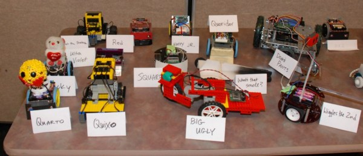
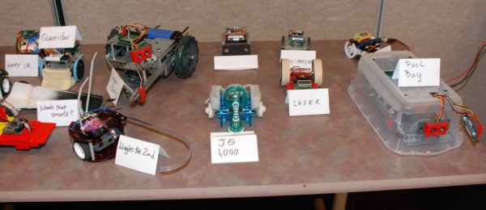
The table of the competitors
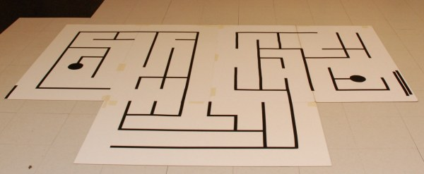
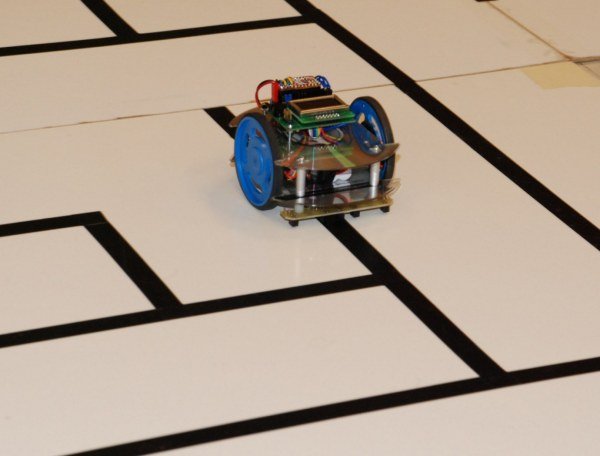
Mini-Mazer running the maze

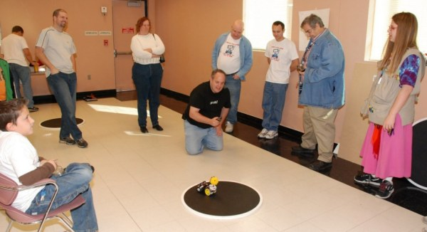
The crowd enjoying the sumo event
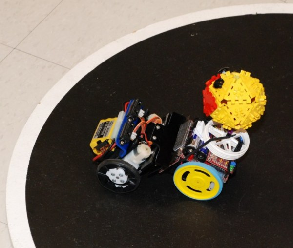
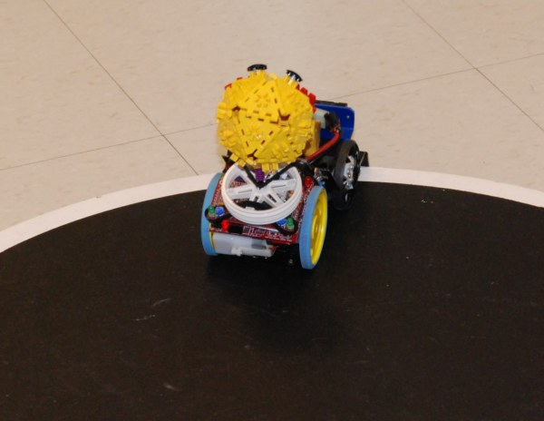
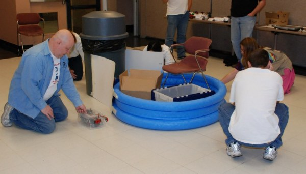
Ready to start the first run on the complex course

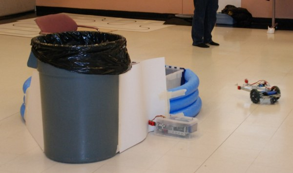
Pool Boy caught in the turn
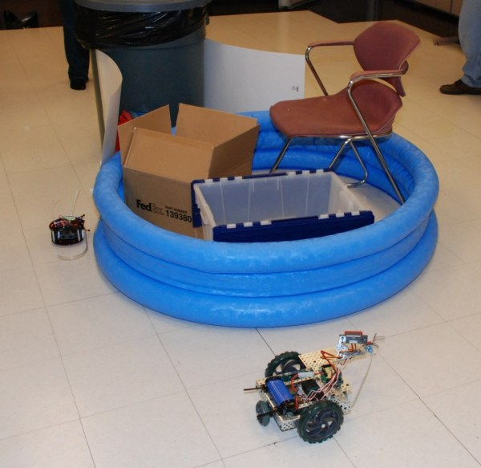
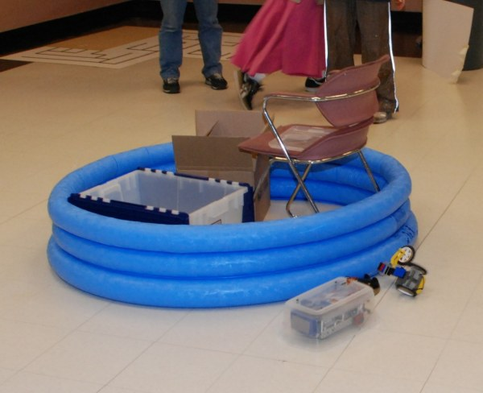
Collision time on the simple course
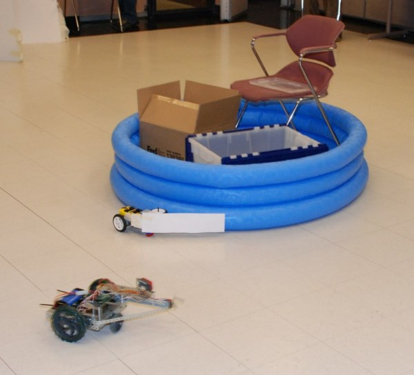
Dog's Pants keeping to the outside
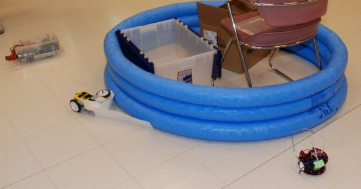
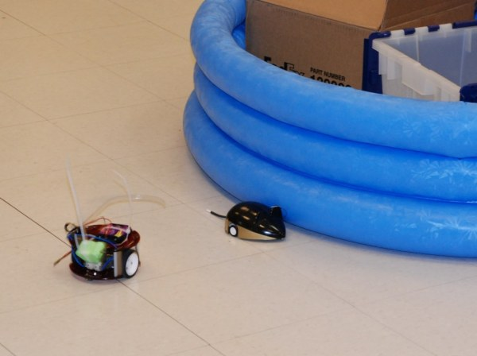
Her Pleasure was small, slow and steady

&nbsp;

<?php include("../eventNavigation.html"); ?>
<?php	insert_left();	?> 	

</body>
</html>
