
Our sixth robot competition was held back at Jack Lund Schofield Middle School in Las Vegas.
We had 28 robots competing in the 6 different events, including our new Walking competetion.

The Best Of Show award went to <a href="https://www.lvbots.org/gallery/member.php?id=60">Bruce Romeo</a> for <a href="https://www.lvbots.org/gallery/bot.php?id=66">Disco Boy</a>.

We would like to thank the following sponsors for their gracious prize dontations:

Line Following Results

We had 13 robots competing in this event.
Robots had to make 3 laps around the track without falling off, and were given 2 chances to do this. 
We started with preliminary races to determine the top 4, and then had a single elimination bracket to
pick the winners.  
The line following track had 12 straight tiles, and 24 curve tiles, for a total 3 lap length of about 2821 cm.  
<table>
<tr><td align="center"></td><td align="center"><b>Robot</b></td><td align="center"><b>Builder</b></td><td align="center"><b>Best Time</b></td></tr>

<tr><td align="center"><b>1st Place</b></td><td align="center">Puck</td><td align="center"><a href="https://www.lvbots.org/gallery/member.php?id=22">Paul Grayson</a></td><td align="center">39.47 seconds</td></tr>
<tr><td align="center"><b>2nd Place</b></td><td align="center"><a href="https://www.lvbots.org/gallery/bot.php?id=41">What's That Smell?</a></td><td align="center"><a href="https://www.lvbots.org/gallery/member.php?id=10">Jan Malasek</a></td><td align="center">42.73 seconds</td></tr>
<tr><td align="center"><b>3rd Place</b></td><td align="center"><a href="https://www.lvbots.org/gallery/bot.php?id=2">Laser</a></td><td align="center"><a href="https://www.lvbots.org/gallery/member.php?id=1">Byon Garrabrant</a></td><td align="center">43.90 seconds</td></tr>
<tr><td align="center"><b>4th Place</b></td><td align="center">Big Ugly</td><td align="center"><a href="https://www.lvbots.org/gallery/member.php?id=12">Candice Kamachi</a></td><td align="center">50.05 seconds</td></tr>
<tr><td align="center"></td><td align="center">Oscar</td><td align="center"></td><td align="center">59.97 seconds</td></tr>
<tr><td align="center"></td><td align="center">No Redeeming Features</td><td align="center"></td><td align="center">1:00.60</td></tr>
<tr><td align="center"></td><td align="center">Poser</td><td align="center"><a href="https://www.lvbots.org/gallery/member.php?id=10">Jan Malasek</a></td><td align="center">1:02.63</td></tr>
<tr><td align="center"></td><td align="center">Van Gogh</td><td align="center">Ben Schmidel</td><td align="center">1:53.54</td></tr>
<tr><td align="center"></td><td align="center"><a href="https://www.lvbots.org/gallery/bot.php?id=64">Anthem</a></td><td align="center"><a href="https://www.lvbots.org/gallery/member.php?id=61">Jamie Gorr</a></td><td align="center">2:30.09</td></tr>
<tr><td align="center"></td><td align="center">Shoe</td><td align="center"><a href="https://www.lvbots.org/gallery/member.php?id=1">Byon Garrabrant</a></td><td align="center">DNF</td></tr>
<tr><td align="center"></td><td align="center">Sled</a></td><td align="center"></td><td align="center">DNF</td></tr>
<tr><td align="center"></td><td align="center"><a href="https://www.lvbots.org/gallery/bot.php?id=65">Rod</a></td><td align="center"><a href="https://www.lvbots.org/gallery/member.php?id=60">Bruce Romeo</a></td><td align="center">DNF</td></tr>
<tr><td align="center"></td><td align="center">Story</td><td align="center"></td><td align="center">DNF</td></tr>
</table>

Mini Sumo Results

We had 4 entrants in the mini sumo event.
The bots were randomly selected for a single elimination bracket of best 2 of 3 battles.
<table>
<tr><td align="center"></td><td align="center"><b>Robot</b></td><td align="center"><b>Builder</b></td><td align="center"><b></b></td></tr>
<tr><td align="center"><b>1st Place</b></td><td align="center">Ultra Violet</td><td align="center"><a href="https://www.lvbots.org/gallery/member.php?id=22">Paul Grayson</a></td><td align="center"></td></tr>
<tr><td align="center"><b>2nd Place</b></td><td align="center">R1</td><td align="center"></td><td align="center"></td></tr>
<tr><td align="center"><b>3rd Place</b></td><td align="center"><a href="https://www.lvbots.org/gallery/bot.php?id=9">Happy Jr.</a></td><td align="center"><a href="https://www.lvbots.org/gallery/member.php?id=1">Byon Garrabrant</a></td><td align="center"></td></tr>
<tr><td align="center"><b>4th Place</b></td><td align="center"><a href="https://www.lvbots.org/gallery/bot.php?id=29">Mr. Happy</a></td><td align="center"><a href="https://www.lvbots.org/gallery/member.php?id=1">Byon Garrabrant</a></td><td align="center"></td></tr>
</table>

Walking

We had 4 competitors in our first ever Walking event.  
Bots had to walk 3 feet to the edge of a board.
<table>
<tr><td align="center"></td><td align="center"><b>Robot</b></td><td align="center"><b>Builder</b></td><td align="center"><b>Time</b></td></tr>
<tr><td align="center"><b>1st Place</b></td><td align="center">Seis</td><td align="center"><a href="https://www.lvbots.org/gallery/member.php?id=1">Byon Garrabrant</a></td><td align="center">6.45 seconds</td></tr>
<tr><td align="center"><b>2rd Place</b></td><td align="center">WTW</td><td align="center"></td><td align="center">11.73 seconds</td></tr>
<tr><td align="center"><b>3rd Place</b></td><td align="center">4-1</td><td align="center"><a href="https://www.lvbots.org/gallery/member.php?id=22">Paul Grayson</a></td><td align="center">27.81 seconds</td></tr>
<tr><td align="center"></td><td align="center"><a href="https://www.lvbots.org/gallery/bot.php?id=66">Disco Boy</a></td><td align="center"><a href="https://www.lvbots.org/gallery/member.php?id=60">Bruce Romeo</a></td><td align="center">DNF</td></tr>
</table>

Dead Reckoning

We modified our Dead Reckoning contest for this competition to have the bot drive to a line, then follow that line, then return to is starting spot.
<table>
<tr><td align="center"></td><td align="center"><b>Robot</b></td><td align="center"><b>Builder</b></td></tr>
<tr><td align="center"><b>1st Place</b></td><td align="center">Van Gogh</a></td><td align="center">Ben Schmidel</td><td align="center">7.35" - 1:08.25</td></tr>
<tr><td align="center"><b>2nd Place</b></td><td align="center">Poser</td><td align="center"><a href="https://www.lvbots.org/gallery/member.php?id=10">Jan Malasek</a></td><td align="center">23" - 49.50 seconds</a></td></tr>
<tr><td align="center"></td><td align="center">CD Bot</td><td align="center"><a href="https://www.lvbots.org/gallery/member.php?id=1">Byon Garrabrant</a></td><td align="center">DNF</a></td></tr>
<tr><td align="center"></td><td align="center">Puck</td><td align="center"><a href="https://www.lvbots.org/gallery/member.php?id=22">Paul Grayson</a></td><td align="center">DNF</a></td></tr>
</table>

 			

Line Maze Results

We had 2 competitors in the Line Maze event.  See video of CD Bot's second run at
<a href="https://www.youtube.com/watch?v=Wjqy3yRFoz8" target="_blank">You Tube</a>.
<table>
<tr><td align="center"></td><td align="center"><b>Robot</b></td><td align="center"><b>Builder</b></td><td align="center"><b>Time</b></td></tr>
<tr><td align="center"><b>1st Place</b></td><td align="center">CD Bot</td><td align="center"><a href="https://www.lvbots.org/gallery/member.php?id=1">Byon Garrabrant</a></td><td align="center">35.55 seconds</td></tr>
<tr><td align="center"></td><td align="center">Puck</td><td align="center"><a href="https://www.lvbots.org/gallery/member.php?id=22">Paul Grayson</a></td><td align="center">DNF</td></tr>
</table>

Pool Race Results

We only had one entrant, but it was able to handle the course.
<table>
<tr><td align="center"></td><td align="center"><b>Robot</b></td><td align="center"><b>Builder</b></td></tr>
<tr><td align="center"><b>1st Place</b></td><td align="center">Road Rage</a></td><td align="center"><a href="https://www.lvbots.org/gallery/member.php?id=10">Jan Malasek</a></td><td align="center"></td></tr>
</table>

Event pictures

Here are a few pictures from the event.
 

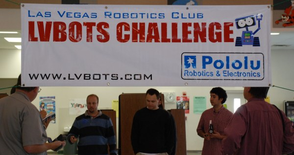
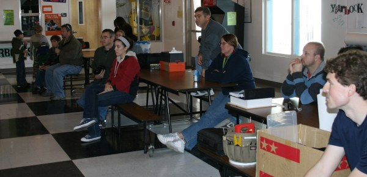
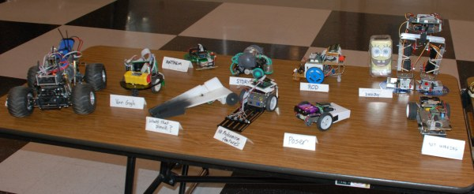
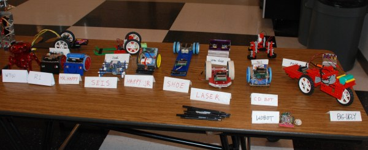
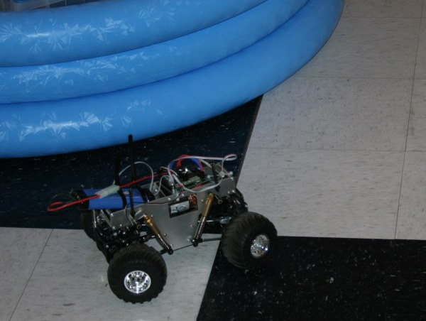
Road Rage
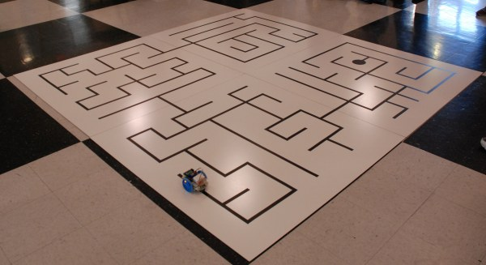
CD Bot on the Line Maze
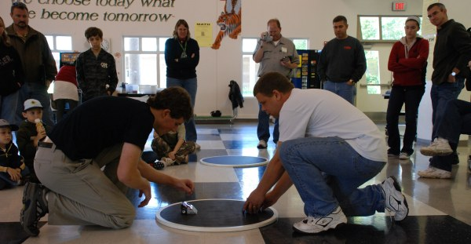

Ultra Violet vs Mr. Happy
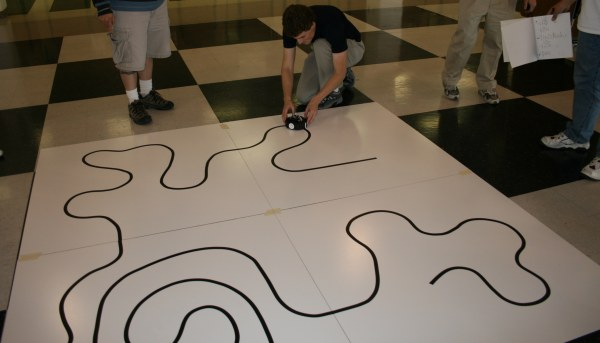
Puck on the Dead Reckoning course
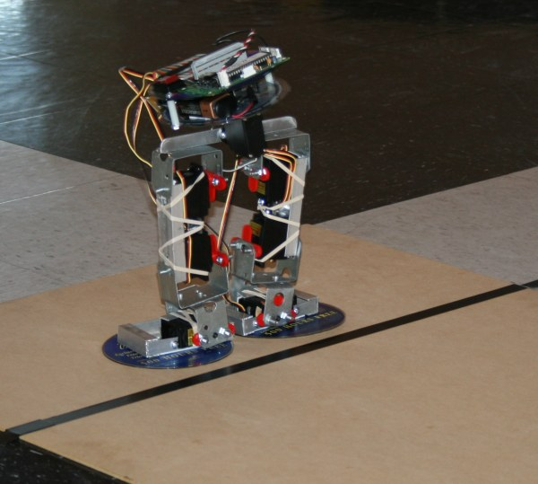
Pool Boy
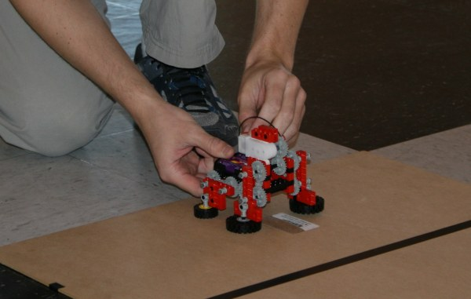
4-1
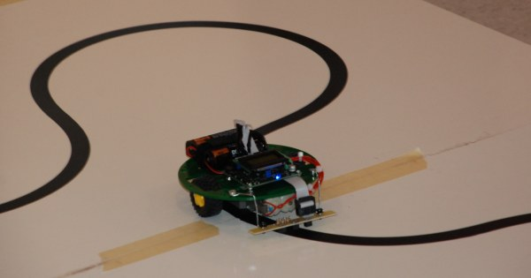
Anthem
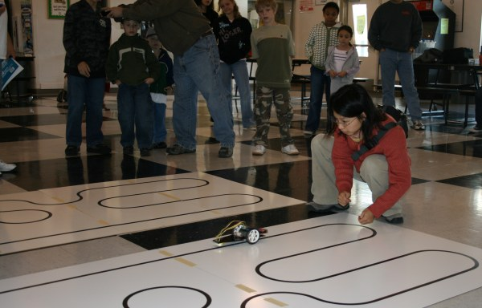
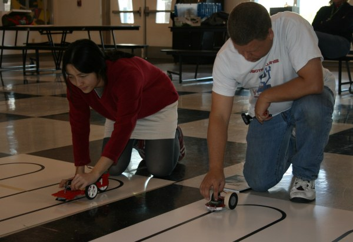
Big Ugly vs. Laser
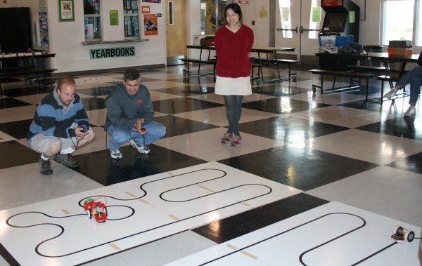
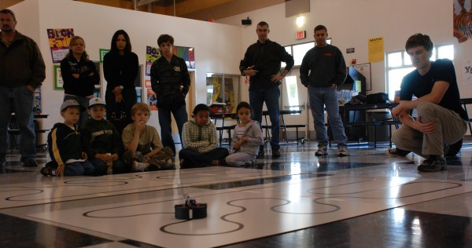
Puck on the Line Following Course
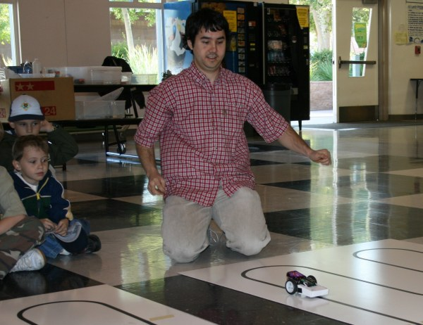
Poser
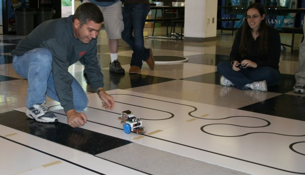
Rod
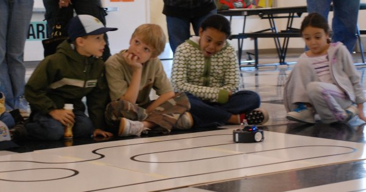
Puck
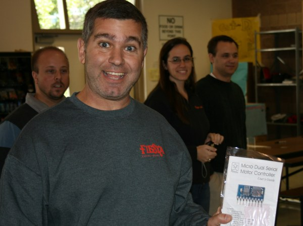
Best of Show Prize

&nbsp;

<?php include("../eventNavigation.html"); ?>
<?php	insert_left();	?> 	

</body>
</html>
