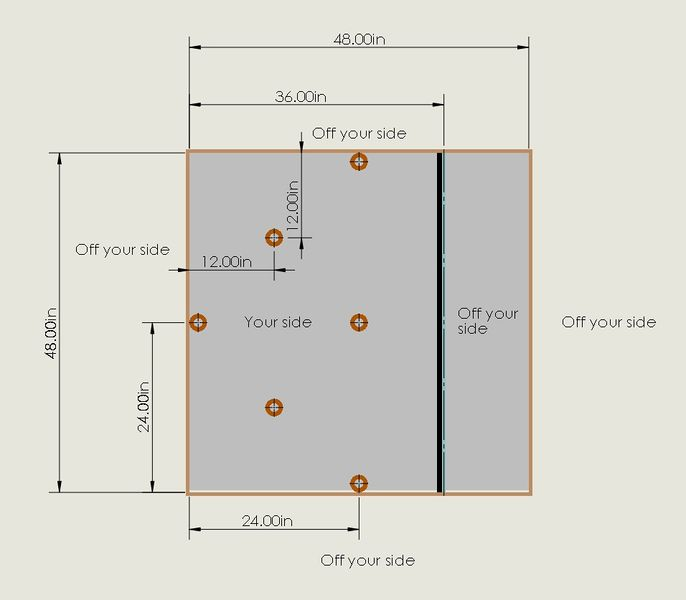

---
layout: default
title: LVBots - Rings/Donut Rules
---

## Goal

Get all the rings off of your side of the field.

## Field

For the first competition the field will consist of a 4x4' square that is divided into two areas. The robot’s area will be 4’x3’. The floor of the field will be whiteboard material and the walls will be light coloured 1/2" plywood approximately 5 3/4" high. Dividing the two areas of the course there will be another piece of plywood suspended approximately 2.5" off the bottom of the field and stretching all the way from one wall to the opposite wall. A line of 3/4" black electrical tape will be placed parallel to the barrier on the floor of the field next to the divider on the robot's side. A diagram of the field is given below:

Here is an early prototype of the field.  Note that it does not have the black tape marking the divider, but that will be added along with making the frame sturdier.

The rings will be hollow plastic donut shaped rings that might vary in sizes and color. The largest ring will be no bigger than 5" in outer diameter and 1 1/2" in height and weigh no more than 35g. The smallest ring will be at least 2.5" in diameter and 3/4" tall and weigh around 15g.  For the first iteration of the competition we will be using only the smallest ring size.  A picture of the smallest ring/donut is given below:

## Setup

Before the start of each robot's turn 6 rings will be placed on the field in predetermined locations. One ring will be touching the wall opposite the divider and two other rings will be touching the side walls (one touching each wall). A picture of the starting layout will be provided and measurements can be given.

The robot can be placed anywhere on its side as long as it is not touching any wall or ring. Once the robot is placed a judge will count down time for the robot and timers to start. The robot should have some way of being started (i.e.push button) at the end of the countdown. Each robot will be given 1 minute to get all the rings off its side of the field.

## Scoring

Each robot will be given two chances to try to clear all the rings, its times on both runs will be averaged to create its final score. The robot with the lowest average time wins.  If there are rings left on the robot's side of the field when time is called, a penalty will be added to the time for that round for each ring left.  The judges will rule about re-tries in cases like a robot losing a sensor or other issues like that.

## Rules

Robots must start on their side of the field and cannot be touching any rings.
No size restrictions except that the robot must fit on the field without touching any rings.
A ring will be considered off your side if no part of it is past the edge of the divider. If the ring is partially under the divider, but does not stick out at all on your side it is considered off your side.
If a ring leaves the field completely it is not on your side.
Robots can move the rings in whatever manner they want, including either under or over the divider.
Robots cannot intentionally damage or dismantle the rings or field.

## To be finalized

* Should we have markers like electrical tape lines to direct robots to the divider or circles or Xs where the rings will start?
* Time limit
